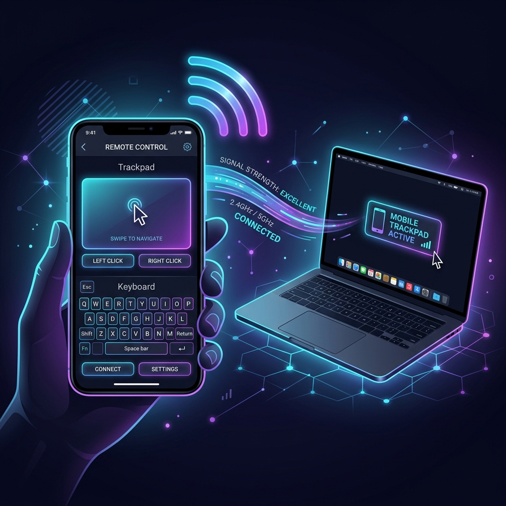

# WiFi Remote Control

A high-performance wireless input system that transforms your Android device into a low-latency trackpad and keyboard for your PC. By leveraging a custom lightweight UDP protocol, the system achieves near-zero latency, suitable for smooth control, presentations, and media management.



## Core Features

- **High-Performance Touchpad**: Multi-touch surface supporting tap-to-click, physical left/right click buttons, and smooth pointer mapping.
- **Drag-Lock Mechanism**: Long-press on the touchpad to engage drag-lock (MOUSEDOWN). The device provides a short haptic vibration to confirm the lock, allowing effortless window dragging, text selection, and drop actions.
- **Momentum & Fling Physics**: Flicking your finger across the trackpad will continue the cursor movement with natural momentum, decaying gradually for a fluid desktop experience.
- **Two-Finger Scrolling**: Drag two fingers vertically to scroll web pages and documents smoothly.
- **Remote Keyboard & Sticky Modifiers**: Full key input redirection with helper keys (Enter, Backspace, Escape, Tab, Arrows, Space) and a sticky ALT modifier button for executing complex shortcut sequences.
- **Quick Hotkeys**: Direct triggers for common actions such as showing/hiding the desktop (Win + D).
- **Server Failsafe**: Stop the server instantly by moving the mouse cursor to the top-left corner of the screen.

---

## Technical Architecture

### Zero-Backlog UDP Networking
To achieve immediate physical response, standard TCP connection overhead is avoided in favor of raw UDP packets. To prevent input lag under network congestion:
- **Motion Slot (Latest-Wins)**: High-frequency mouse movement (`MOVE`) and scroll packets are stored in a single atomic memory slot. When the network thread is ready to send, it grabs the newest packet and clears the slot, dropping intermediate obsolete coordinates.
- **Guaranteed Event Queue**: Discrete events (clicks, key presses, hotkeys) are queued separately in a bounded FIFO queue so that clicks are never dropped.

---

## Getting Started

### 1. PC Server Setup
The PC server is a lightweight Python script that processes socket commands using `pyautogui`.

#### Prerequisites
Ensure you have Python 3 installed. Install the required dependency:
```bash
pip install pyautogui
```

#### Running the Server
Run the server script from the project root:
```bash
python server.py
```
*Note: To terminate the server, press `Ctrl + C` in the console, or slide your mouse cursor to the absolute top-left corner of your monitor (Failsafe).*

### 2. Android Client Setup
1. Open the project in **Android Studio**.
2. Connect your Android device via USB or ensure the emulator is running.
3. Build and run the `app` module on your device.
4. Ensure your phone and PC are connected to the same local network (Wi-Fi).
5. Enter your PC's local IP address in the application dashboard and tap **Trackpad** or **Keyboard** to begin.

---

## Protocol Commands
The client transmits plain-text commands over UDP (default port `5005`):

| Command Format | Action | Description |
| :--- | :--- | :--- |
| `MOVE,dx,dy` | Move cursor | Relative movement offset coordinates |
| `CLICK,L\|R\|M` | Click | Left, Right, or Middle click |
| `DBLCLICK` | Double Click | Performs a quick left double click |
| `SCROLL,n` | Scroll | Vertical scroll amount (positive = up, negative = down) |
| `MOUSEDOWN,L\|R` | Mouse Button Down | Holds down the specified mouse button |
| `MOUSEUP,L\|R` | Mouse Button Up | Releases the specified mouse button |
| `KEY,value` | Key Press | Sends a character or mapped special key |
| `HOTKEY,k1,k2` | Hotkey Shortcut | Holds down multiple keys simultaneously (e.g. `alt,tab`) |
